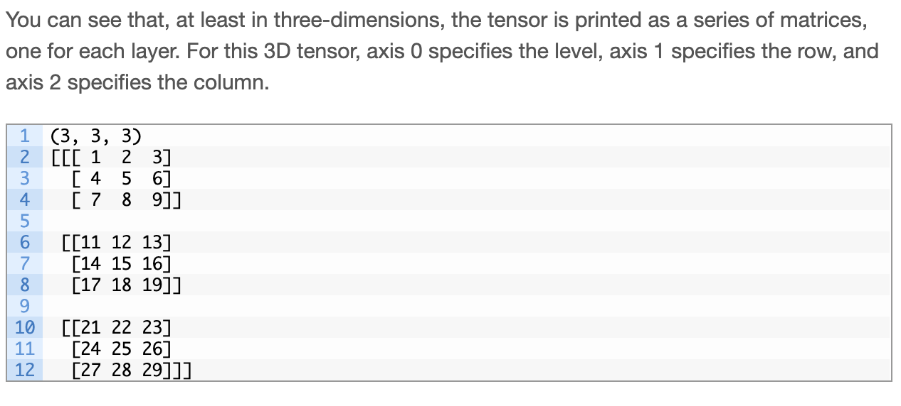

# tensorflow

what is a tensor, scalar, matrix, and vector?

- a **tensor** is a generalization of vectors and matrices and is easily understood as a multidimensional array of numbers arranged on a regular grid with a variable number of axes is known as a tensor.

- a **scalar** = a value having only magnitude, not direction.
- a **vector** is a one-dimensional (first order tensor)
- a **matrix** is a two-dimensional (second order tensor).

Running the example first prints the shape of the tensor, then the values of the tensor itself.

---
